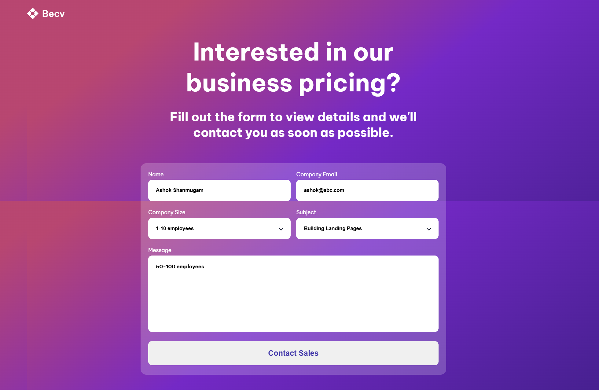

# Contact Form | devChallenges

   Solution for a challenge <a href="https://devchallenges.io/challenge/contact-page" target="_blank">Contact Page</a> from <a href="http://devchallenges.io" target="_blank">devChallenges.io</a>.

  <h3>
    <a href="https://your-demo-link.your-domain">
      Demo
    </a>
     | 
    <a href="https://github.com/Thaththathirian/contact-form.git">
      Solution
    </a>
     | 
    <a href="https://devchallenges.io/challenge/contact-page">
      Challenge
    </a>
  </h3>

## Table of Contents

- [Overview](#overview)
  - [What I learned](#what-i-learned)
  - [Useful resources](#useful-resources)
- [Built with](#built-with)
- [Features](#features)
- [Contact](#contact)
- [Acknowledgements](#acknowledgements)

## Overview

### What I learned

Working on this project, I applied my knowledge of **HTML, CSS, and responsive design** to build a well-structured and user-friendly contact form. Some key takeaways include:
- Implementing **CSS Grid** for layout structuring.
- Using **custom properties (CSS variables)** for better styling consistency.
- Handling **form styling** effectively.
- Adding **hover and focus states** for a better user experience.
- Debugging layout issues related to **alignment and spacing** in different screen sizes.

### Useful resources

- [CSS Grid Guide](https://css-tricks.com/snippets/css/complete-guide-grid/) - Helped me structure the form layout effectively.
- [Google Fonts](https://fonts.google.com/) - Used to integrate a custom font for a better visual experience.
- [MDN Flexbox Guide](https://developer.mozilla.org/en-US/docs/Learn/CSS/CSS_layout/Flexbox) - Helped with flexible alignment.

### Built with

- **Semantic HTML5 markup**
- **CSS custom properties**
- **Flexbox**
- **CSS Grid**
- **Google Fonts**
- **Responsive design techniques**

## Features

- 📌 Fully responsive contact form  
- 🎨 Styled with **CSS Grid & Flexbox**  
- 🔍 Includes input focus and hover effects  
- 📱 Mobile-friendly design  

## Acknowledgements

A big thank you to **DevChallenges.io** for providing the challenge and inspiration to work on this project.

## Author

- Website: [sampintn.com](https://sampintn.com)
- GitHub: [@Thaththathirian](https://github.com/Thaththathirian)